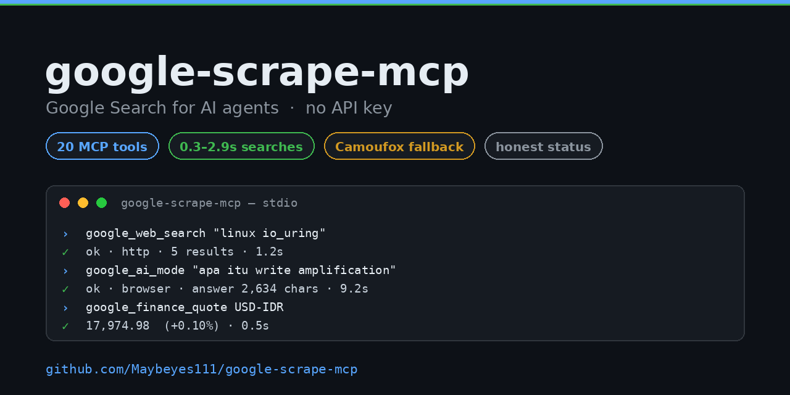
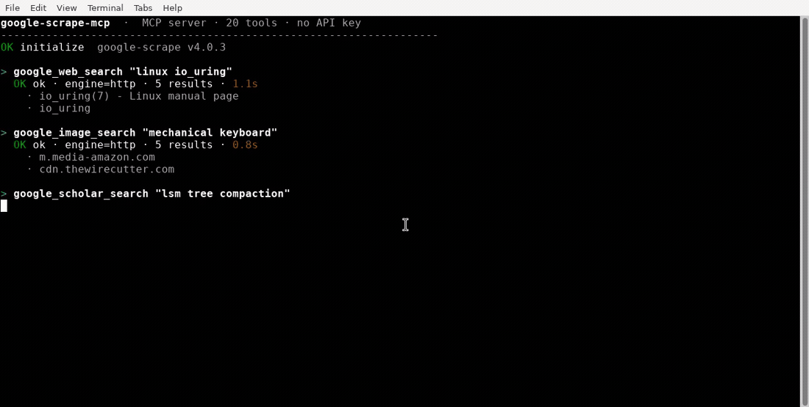

# google-scrape-mcp

[](LICENSE)
[](https://www.python.org/)
[](https://github.com/Maybeyes111/google-scrape-mcp/security/code-scanning)
[](https://github.com/Maybeyes111/google-scrape-mcp/actions/workflows/bandit.yml)
[](https://github.com/Maybeyes111/google-scrape-mcp/security)
[](https://modelcontextprotocol.io)



MCP server that gives AI agents real Google results with no API key: a measured
HTTP fast path (0.3–2.9s searches), a Camoufox browser fallback that actually
runs the JS challenges, adaptive cooldowns derived from probing, and honest
status codes instead of fabricated results.



Full-quality recording: [`assets/demo_real.mp4`](assets/demo_real.mp4) (24s).
Every number in that recording is from a real run: web 1.1s, images 0.8s,
scholar 7.1s, AI Mode 9.2s (2,548 chars), USD/IDR quote 0.5s.

## 1. What it does

- Searches Google across web, images, videos, news, books, shopping, scholar,
  patents and AI Mode through one MCP server.
- Answers each request with `status: ok | blocked | rate_limited | limited |
  empty | error`. When Google blocks, it says so. It never invents results.
- Keeps a browser profile warm so HTML pages that need JavaScript (scholar,
  AI Mode) come back complete.
- Exposes RSS/JSON endpoints (news, patents, trends, suggest, translate,
  finance) that are never blocked, for when reliability matters more than
  coverage.

## 2. Install

```bash
pip install -e .             # HTTP engine only
pip install -e ".[browser]"  # + Camoufox browser engine
camoufox fetch               # download the Camoufox browser once
```

Core dependencies: `fastmcp`, `curl_cffi`, `beautifulsoup4`, `lxml`,
`defusedxml`. Optional: `camoufox` for the browser engine.

## 3. MCP client config

```json
{
  "mcpServers": {
    "google-scrape": {
      "command": "google-scrape-mcp"
    }
  }
}
```

Run `google-scrape-mcp` directly for stdio transport. Agents can call the
`google_help` tool for a runtime usage guide, or read
[`AGENT_GUIDE.md`](AGENT_GUIDE.md).

## 4. Tools (20)

| Tool | Source | Notes |
|---|---|---|
| `google_search` | unified: `tab` = web/images/videos/news/books/shopping/scholar/patents/ai, `page` 1–10 | dispatcher for the tools below |
| `google_web_search` | organic results, featured snippet, related searches | HTTP fast path, browser fallback |
| `google_image_search` | direct image URLs, page URLs, dimensions | fast path |
| `google_video_search` | `tbm=vid` | fast path |
| `google_books_search` | `tbm=bks` | fast path |
| `google_shopping_search` | title, price, was-price, merchant, rating | fast path when the markup allows, browser otherwise |
| `google_news_search` / `google_news_homepage` | News RSS | never blocked |
| `google_scholar_search` | papers, venue, citations, PDF links | browser (HTTP 429) |
| `google_scholar_cited_by` | Scholar `cites=` | extra protection, often `blocked` and reported as such |
| `google_patents_search` | Patents XHR JSON | never blocked |
| `google_finance_quote` | stocks, forex, crypto (`USD-IDR`, `BBCA:IDX`) | never blocked |
| `google_translate` | unofficial `gtx` endpoint | never blocked |
| `google_suggest` | autocomplete | never blocked |
| `google_trends_daily` | Trends RSS | never blocked |
| `google_trends_interest` | explore into multiline widgetdata | HTTP often 401, browser fallback |
| `google_ai_mode` | AI Mode (`udm=50`), synthesized `answer` + `sources` | browser, JS streams the answer |
| `google_crawl` | read any URL: title, meta, text, links | live |
| `google_help` | agent usage guide | live |
| `google_status` | endpoints, proxies, cache, cooldowns, forensics | live |

## 5. Engines and the cookie fast path

Every search tool takes an `engine` argument:

- `auto` (default): HTTP first, browser when needed.
- `http`: direct only. Fast, challenge-prone on flagged IPs.
- `proxy`: force the proxy pool.
- `browser`: Camoufox headless render, 5–15s.

The fast path works like this. A browser homepage visit mints fresh session
cookies (`NID`, `AEC`, `SNID`, `GSP`). Plain HTTP `/search` with those cookies,
a coherent `Referer`/`Sec-Fetch-Site` and a clean cookie jar passes in
0.3–2.9s. Surfaces proven to pass over HTTP: web, images, videos, books,
shopping. Scholar (HTTP 429) and AI Mode (answer is streamed by JS) stay on
the browser. Cookies are cached for 5 minutes and refreshed in the background
while tools are in use, so searches rarely pay the warm-up cost.

Findings behind this are documented with measurements in
[`RESEARCH.md`](RESEARCH.md).

## 6. Performance (measured)

| Operation | Before | Now |
|---|---|---|
| Web search (end-to-end) | ~1.0s | 0.3–0.7s |
| Browser warm-up + cookies | 16.4s | 5.7s |
| Scholar search | 11.3s | 4.2–4.4s |
| AI Mode answer | 11.1s, sometimes truncated | 9–11s, complete |
| SERP parse + `/goto` resolution | sequential | parallel, ~0.5s |

Mechanisms: one priority job for warm-up plus cookies, adaptive warm-up
skipping (`GOOGLE_SCRAPE_WARM_TTL`), selector and text-stability waits instead
of fixed sleeps, parallel `/goto` resolution, a background bootstrap keeper,
and a 1.5–3.5s human-like gap between browser jobs.

## 7. Anti-block research

The repository ships the methodology, not just the result:

- `python3 -m google_scrape_mcp.probe --quick|--full|--tls|--analyze` runs a
  controlled endpoint/engine matrix with human-like spacing.
- Blocked pages are sampled to `~/.cache/google-scrape-mcp/forensics/` with
  counters in `block_stats.json`, surfaced by `google_status`.
- Adaptive cooldowns are per endpoint family (search/scholar/finance), with
  escalating backoff and a fail-fast browser cooldown. Burned browser profiles
  are rotated automatically.

Measured conclusions, including why raw HTTP `/search` always gets a JS
challenge and why cookies alone do not fix it, are in
[`RESEARCH.md`](RESEARCH.md).

## 8. Proxy pool

Accepted formats: `http://host:port`, `https://host:port`,
`socks5://host:port` (`socks5h` normalized), `socks4://host:port`, with
optional `user:pass@`, plus bare `host:port` and `host:port:user:pass`.

Sources, in priority order:

1. `GOOGLE_SCRAPE_PROXIES`: inline list (comma/space/newline separated) or a
   file path (starting with `/`, `~`, or ending in `.txt`).
2. `GOOGLE_SCRAPE_PROXY_FILES`: colon-separated file paths.
3. Defaults when present: `~/.config/google-scrape/proxies.txt` and
   `~/.cache/google-scrape-mcp/proxies_curated.txt`.

Free lists work here, but only when combined with the bootstrap cookies:
with fresh cookies, clean proxies pass `/search` (4/8 live proxies in one
measured run); without them everything gets a JS challenge. `curate` is
cookie-aware, clears the cookie jar before probing, limits search concurrency
(session cookies plus parallel IPs looks anomalous), and writes the fastest
proxies first. From the public hproxy list, 8 of 36 live proxies made it into
the curated pool.

```bash
python3 -m google_scrape_mcp.curate --limit 100 --workers 8
```

Failed proxies get a cooldown. Browser fallback only uses proxies that have
succeeded before, so a dead pool never burns minutes.

## 9. Environment variables

| Variable | Default | Purpose |
|---|---|---|
| `GOOGLE_SCRAPE_PROXY_MODE` | `auto` | `auto`, `off`, or `always` |
| `GOOGLE_SCRAPE_PROXY_COOLDOWN` | `600` | failed-proxy cooldown (s) |
| `GOOGLE_SCRAPE_PROXY_CA` | | extra CA bundle for self-signed HTTPS proxies |
| `GOOGLE_SCRAPE_MIN_INTERVAL` | `1.0` | minimum delay between requests (s) |
| `GOOGLE_SCRAPE_TIMEOUT` | `25` | request timeout (s) |
| `GOOGLE_SCRAPE_RETRIES` | `3` | proxy attempts per request |
| `GOOGLE_SCRAPE_CACHE_TTL` | `600` | response cache TTL, `0` disables |
| `GOOGLE_SCRAPE_CACHE_MAX` | `256` | max cache entries |
| `GOOGLE_SCRAPE_IMPERSONATE` | `chrome120` | curl_cffi TLS target |
| `GOOGLE_SCRAPE_JS_COOLDOWN` | `600` | base HTTP cooldown after a block, doubles per level, capped at 1h |
| `GOOGLE_SCRAPE_COOKIE_TTL` | `300` | bootstrap cookie lifetime (s) |
| `GOOGLE_SCRAPE_BROWSER_COOLDOWN` | `180` | base browser cooldown after a block |
| `GOOGLE_SCRAPE_WARM_TTL` | `600` | skip the homepage warm-up if warmed more recently |
| `GOOGLE_SCRAPE_JOB_GAP` | `1.5-3.5` | human-like gap between browser jobs (s) |
| `GOOGLE_SCRAPE_KEEPER` | `1` | background bootstrap keeper, `0` disables |
| `GOOGLE_SCRAPE_FORENSICS` | `1` | save blocked-page samples |
| `GOOGLE_SCRAPE_NO_SELFHEAL` | | disable automatic `camoufox fetch` when missing |

## 10. Security

- CodeQL (Python) and Bandit run on every push and weekly.
- Dependabot keeps dependencies and GitHub Actions updated, grouped weekly.
- Secret scanning with push protection is enabled.
- `main` is protected against force pushes and deletion, including admins.
- XML feeds are parsed with `defusedxml` when available.
- Reporting: see [`SECURITY.md`](SECURITY.md).

## 11. Project layout

```
src/google_scrape_mcp/
  server.py      MCP tools, engine orchestration, status
  client.py      HTTP path: sessions, cache, cooldowns, bootstrap cookies
  browser.py     Camoufox worker: persistent profile, challenges, rotation
  parsers.py     SERP/RSS/JSON parsing, AI Mode cleanup, shopping cards
  proxies.py     proxy pool: parsing, rotation, cooldowns, proven-only usage
  forensics.py   block taxonomy samples and counters
  probe.py       research harness (block measurement)
  curate.py      proxy curation (liveness + /search capability)
```

Docs: [`AGENT_GUIDE.md`](AGENT_GUIDE.md) for agents,
[`RESEARCH.md`](RESEARCH.md) for the anti-block measurements.

## 12. Known limitations

- `google_scholar_cited_by` is often `blocked` (Google protects that endpoint
  harder). The `cited_by` count from `google_scholar_search` still works.
- Shopping does not expose product URLs in the initial HTML; links render on
  click.
- No Maps/local search, reverse image search, inline AI Overview, or flights.
- Datacenter proxy pools are mostly useless for Google. Prefer residential.

## 13. License

MIT, see [LICENSE](LICENSE).
